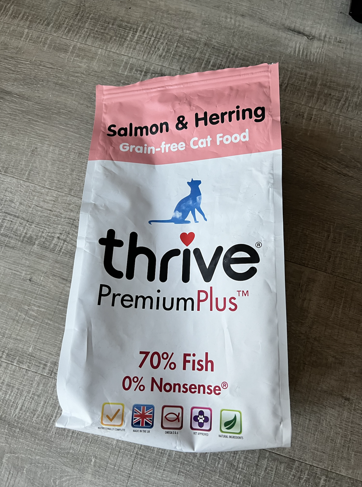

# Pepsi 首席铲屎官指南
---
## 投喂指南
1. 干粮：一天一猫碗，大约65g/天，可以分2-4次投喂
2. 罐罐：一天最多一个罐罐，如果投喂了罐罐，可以适当减少一半干粮，一周可以喂0-4次罐罐
3. 水：每天换两次水，用过滤水
4. 零食：0-10小块一天 可以不投喂

## 铲屎
可以1-4天铲屎一次，根据铲屎官的时间来安排

## Vet
- 如果Pepsi感到不适或者生病 下面是Vet信息
- [Poplar Vet](https://www.vet.co.uk/)
- Tel: 020 7515 2505

## 图片Reference
下面是图片，猫砂在鞋架旁边，剩下的都在客厅猫爬架下面。
- 干粮：
- 罐罐：
- 喷泉：
- 零食鸡肉条：
- 零食冻干：
- 零食猫条： 
- 自动喂饭机： 
- 猫砂： 